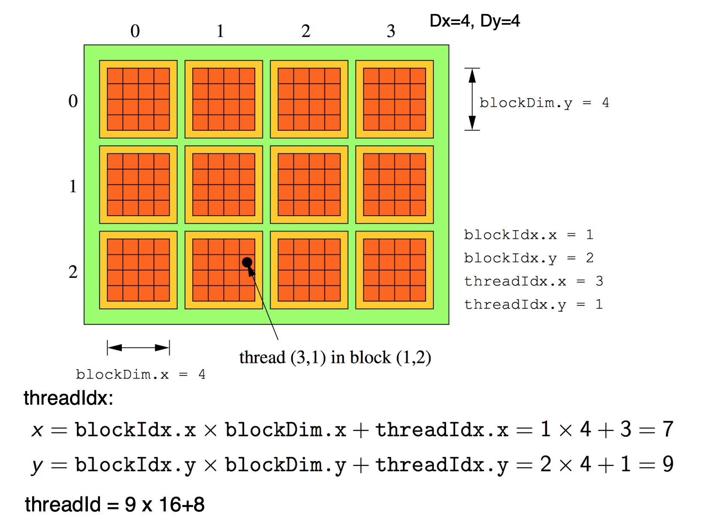

# CUDA Basis

## (1) Thread, Block, Grid
There is a limit to the number of threads per block, since all threads of a block are expected to reside on the same processor core and must share the limited memory resources of that core. On current GPUs, a thread block may contain up to **1024** threads.

### 2D grid

Thread Index (threadIdx) and ThreadId
    * In 1-D: For one block, the unique threadId of thread of index (x) = x or threadIdx.x = x; Maximum size problem: 1024 threads   

    * In 2-D, with block of size (Dx, Dy), the unique threadId of thread with index (x,y): threadId= x+y*Dx, threadIdx.x = x; threadIdx.y = y   

    * In 3-D, with block of size (Dx,Dy, Dz), the unique threadID of thread with index (x,y,z): threadId = x+y*Dx+z*Dx*Dz, threadIdx.x = x; threadIdx.y = y; threadIdx.z = z

    * Total number of threads = Thread_per_block* Number of blocks

Max number of threads_per_block = 1024 for Cuda Capability 2.0 +, Max dimensions of thread block (1024,1024, 64) but max threads 1024, **Typical sizes: (16, 16), (32, 32) optimum size will depend on program.**

```
dim3 threadsPerBlock(4,4); //Dx, Dy = BlockDim
dim3 numBlocks(4, 3)    // GridDim
MatAdd<<<numBlocks, threadsPerBlock>>(A,B,C);

// https://stackoverflow.com/questions/16619274/cuda-griddim-and-blockdim/16619633
// then in your kernel had threadIdx.x + blockIdx.x*blockDim.x you would effectively have:

threadIdx.x range from [0 ~ 4)

blockIdx.x range from [0 ~ 4)

blockDim.x equal to 4

gridDim.x equal to 4
```

<center>

</center>


### reference links
* [Official E-book CUDA C Programming Guide](https://docs.nvidia.com/cuda/archive/9.2/cuda-c-programming-guide/index.html#kernels)
* [PDF link](https://www.ce.jhu.edu/dalrymple/classes/602/Class10.pdf)
* [Cuda gridDim and blockDim](https://stackoverflow.com/questions/16619274/cuda-griddim-and-blockdim/16619633)
* [Divide the work of a 3D kernel among blocks](https://stackoverflow.com/questions/16724844/divide-the-work-of-a-3d-kernel-among-blocks)
* [What is the canonical way to check for errors using the CUDA runtime API?](https://stackoverflow.com/questions/14038589/what-is-the-canonical-way-to-check-for-errors-using-the-cuda-runtime-api)
* [sending 3d array to CUDA kernel](https://stackoverflow.com/questions/12924155/sending-3d-array-to-cuda-kernel/12925014#12925014)
* [Strange cuBLAS gemm batched performance](https://stackoverflow.com/questions/48519861/strange-cublas-gemm-batched-performance)
* [cublasSgemmBatched-example](https://github.com/pyrovski/cublasSgemmBatched-example)
* [How performing multiple matrix multiplications in CUDA?](https://stackoverflow.com/questions/23743384/how-performing-multiple-matrix-multiplications-in-cuda)
* [cudaMallocPitch and cudaMemcpy2D](https://github.com/OrangeOwlSolutions/General-CUDA-programming/wiki/cudaMallocPitch-and-cudaMemcpy2D)
* [Tricks and Tips: cudaMallocPitch and cudaMemcpy2D](http://www.orangeowlsolutions.com/archives/613)
* [https://developer.nvidia.com/sites/default/files/akamai/cuda/files/Misc/mygpu.pdf](https://developer.nvidia.com/sites/default/files/akamai/cuda/files/Misc/mygpu.pdf)

## (2) cudaMallocPitch 
```
__host__ ​cudaError_t cudaMallocPitch ( void** devPtr, size_t* pitch, size_t width, size_t height ) 
```
Description

Allocates at least **width (in bytes) * height** bytes of linear memory on the device and returns in *devPtr a pointer to the allocated memory. The function may pad the allocation to ensure that corresponding pointers in any given row will continue to meet the alignment requirements for coalescing as the address is updated from row to row. **The pitch returned in *pitch by cudaMallocPitch() is the width in bytes of the allocation.** The intended usage of pitch is as a separate parameter of the allocation, used to compute addresses within the 2D array. Given the row and column of an array element of type T, the address is computed as: 
```
T* pElement = (T*)((char*)BaseAddress + Row * pitch) + Column;
// example: Matrix A = (M, N), M rows and N cols, all values are float type
// host: malloc(M*N*sizeof(float))
// device: malloc(N*sizeof(float)*M), if the width in bytes = 128*x; x->(1,2,3,.....)
// bytes in device >= bytes in host
```

## (3) my fault

* 2019/12/10
    * Error1: number of threads in each block should be less than 1024
    * Error2: cudaMallocPitch allocates bytes in device should consider alignment restrictions
    * 错误1：把单个block的thread数量的限制没搞清，需要<1024
    * 错误2：cudaMallocPitch函数的在分配到device上的空间的字节对齐问题


